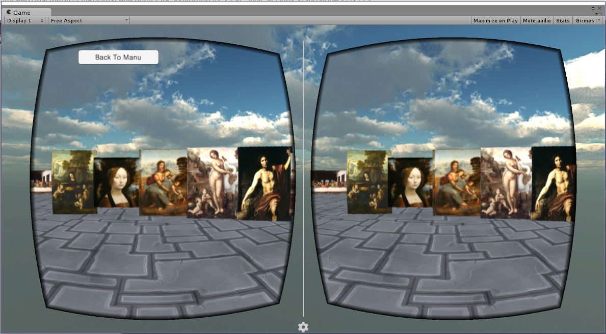

# Unity 3D Virtual Reality Museum with MySQL
## Keywords
* MySQL, Unity, 3D, virtual reality(VR), C#, Linux
## Introduction
* Developed MySQL database including 21 tables, triggers, procedures, views… 
* Applied database on Linux (Ubuntu) system, and set the privileges, so that database can be accessed remotely 
* Created the technologies, including scene, gameobject, transform, quaternion, material, texture, rendering, etc., in Unity3D, making the 3D space with gameobjects. Applied the Google Cardboard SDK in Unity3D to make 3D Camera. 
* Used c# to make four important parts to execute Unity game, including AccessDatabase.cs, LoginGUI.cs, ReadFig.cs, ChangeScene.cs.  
* In the AccessDatabase.cs, applied the functions and variabilities of library System.Data and MySql.Data.MySqlClient. Set Connect information to access remote MySql server in Linux. 
* In LoginGUI.cs, configured the variabilities transferring, depending on the default function operations method. The functions including, Awake(), Start(), Update(), OnGUI(), etc. 
* In ReadFig.cs, researched the Quaternion and Vector3 Coordinate System. Applied the Resources.Load to get textures and render them on Instantiate Prefab clones. 
* In ChangeScene.cs, applied UI button and the function Application.LoadLevel to change game scene.
## Database
EER diagram

Database connection

## Unity 3D Game Screeshots
Login page

The Unity 3D game

